# VEO Games v2 Pipeline Flow

## Goals & Shots Validation Pipeline

This diagram shows how our validation pipeline processes AI-detected events and cross-references them with VEO ground truth data.

```mermaid
graph TD
    A["5_complete_timeline.txt<br/>(Raw AI: 465 clips analyzed)"] --> B["6_goals_shots_validator.py<br/>(Kickoff Logic + Gemini)"]
    B --> C["6_validated_timeline.txt<br/>(2 goals → Should be 1!)"]
    
    C --> D["6.5_accuracy_evaluator.py<br/>(Scientific Comparison)"]
    E["1_veo_ground_truth.json<br/>(1 goal + 38 shots)"] --> D
    D --> F["6.5_accuracy_comparison.txt<br/>(50% precision, 100% recall)"]
    
    C --> G["7_definite_events_builder.py<br/>(VEO Cross-Reference)"]
    E --> G
    G --> H["7_definite_events.txt<br/>(ONLY VEO-confirmed events)"]
    
    A --> I["8_other_events_extractor.py<br/>(Fouls, Cards, Corners)"]
    I --> J["8_other_events.txt<br/>(767 lines of events)"]
    
    H --> K["9_convert_to_web_format.py<br/>(Final JSON Builder)"]
    J --> K
    K --> L["web_events.json<br/>(Should have 1 goal, not 3!)"]
    
    style B fill:#e1f5fe,stroke:#01579b,stroke-width:2px
    style D fill:#e8f5e8,stroke:#2e7d2e,stroke-width:2px
    style G fill:#fff3e0,stroke:#ef6c00,stroke-width:2px
    style I fill:#f3e5f5,stroke:#7b1fa2,stroke-width:2px
    style K fill:#fce4ec,stroke:#c2185b,stroke-width:2px
```

## Key Issues Identified

### 🚨 Problem: Step 6 Validator is Broken
- **Current:** Validates 2 goals (46:15 penalty + 65:30 fake goal)
- **Should:** Only validate 1 goal (the VEO-confirmed 45:53 penalty)
- **Fix needed:** Validator must cross-check against VEO ground truth

### ✅ Success: Step 7 Fixed
- **Before:** Used raw timeline (ignoring validation)
- **After:** Now uses validated timeline from step 6
- **Result:** Proper flow from validation → definite events

### 🎯 Expected Outcome
- **Final web JSON should contain:** 1 goal (not 3)
- **Accuracy:** 100% precision for goals (no false positives)
- **VEO alignment:** Only events that exist in ground truth

## Color Legend
- **Blue:** Goals/Shots Validator (needs VEO cross-check fix)
- **Green:** Accuracy Evaluator (working correctly)
- **Orange:** Definite Events Builder (fixed to use validated input)
- **Purple:** Other Events Extractor (working correctly)  
- **Pink:** Web Format Converter (should output correct events once validator is fixed)