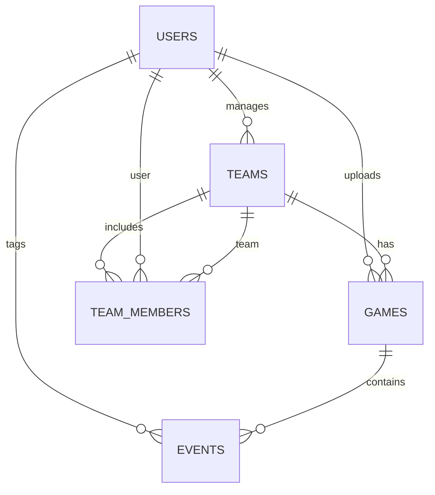

# 📊 ClannAI Database Schema

## 🗺️ Entity Relationship Diagram (ERD)

---

## 🗂️ Main Tables & Fields

### **users**
| Field         | Type         | Constraints                |
|---------------|--------------|----------------------------|
| id            | UUID (PK)    | primary key, unique        |
| email         | VARCHAR      | unique, not null           |
| password_hash | VARCHAR      | not null                   |
| name          | VARCHAR      |                            |
| role          | VARCHAR      | (admin, manager, player)   |
| created_at    | TIMESTAMP    | default now()              |
| updated_at    | TIMESTAMP    | default now()              |

### **teams**
| Field         | Type         | Constraints                |
|---------------|--------------|----------------------------|
| id            | UUID (PK)    | primary key, unique        |
| name          | VARCHAR      | not null                   |
| owner_id      | UUID (FK)    | references users(id)       |
| created_at    | TIMESTAMP    | default now()              |
| updated_at    | TIMESTAMP    | default now()              |

### **team_members**
| Field         | Type         | Constraints                |
|---------------|--------------|----------------------------|
| id            | UUID (PK)    | primary key, unique        |
| team_id       | UUID (FK)    | references teams(id)       |
| user_id       | UUID (FK)    | references users(id)       |
| role          | VARCHAR      | (manager, player, etc.)    |
| joined_at     | TIMESTAMP    | default now()              |

### **games**
| Field         | Type         | Constraints                |
|---------------|--------------|----------------------------|
| id            | UUID (PK)    | primary key, unique        |
| team_id       | UUID (FK)    | references teams(id)       |
| uploader_id   | UUID (FK)    | references users(id)       |
| title         | VARCHAR      | not null                   |
| video_url     | VARCHAR      |                            |
| status        | VARCHAR      | (processing, ready, error) |
| created_at    | TIMESTAMP    | default now()              |
| updated_at    | TIMESTAMP    | default now()              |

### **events**
| Field         | Type         | Constraints                |
|---------------|--------------|----------------------------|
| id            | UUID (PK)    | primary key, unique        |
| game_id       | UUID (FK)    | references games(id)       |
| user_id       | UUID (FK)    | references users(id)       |
| type          | VARCHAR      | (goal, shot, pass, etc.)   |
| timestamp     | INTEGER      | seconds or ms in video     |
| team_id       | UUID (FK)    | references teams(id)       |
| player        | VARCHAR      | optional                   |
| coordinates   | JSONB        | { x: float, y: float }     |
| metadata      | JSONB        | tags, notes, etc.          |
| created_at    | TIMESTAMP    | default now()              |

---

## 🔗 **Relationships & Indexes**
- **users.email**: unique index
- **teams.owner_id**: foreign key to users
- **team_members.team_id, team_members.user_id**: composite unique index
- **games.team_id, games.uploader_id**: foreign keys
- **events.game_id, events.user_id, events.team_id**: foreign keys
- **events.timestamp**: index for fast timeline queries

---

## 📝 **Notes**
- Use UUIDs for all primary keys for scalability and security
- Use JSONB for flexible event metadata and coordinates
- Add more tables (payments, notifications, etc.) as needed
- Update this schema as the project evolves 