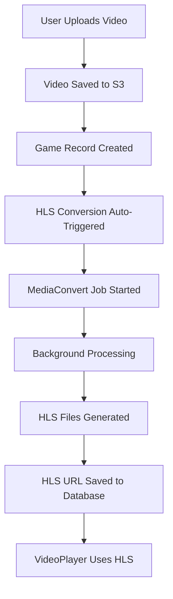

# HLS (HTTP Live Streaming) Implementation

## Overview

This document describes the HLS adaptive streaming implementation for ClannAI video playback. HLS provides automatic quality adjustment based on network conditions and device capabilities.

## Features

- ✅ **Auto-conversion**: Videos automatically convert to HLS on upload
- ✅ **Adaptive streaming**: Multiple quality levels (360p, 720p, 1080p)
- ✅ **Graceful fallback**: Falls back to MP4 if HLS unavailable
- ✅ **Background processing**: Non-blocking conversion using AWS MediaConvert
- ✅ **Database integration**: HLS URLs stored and served automatically

## Architecture

### Database Schema
```sql
-- HLS conversions table
CREATE TABLE hls_conversions (
    id SERIAL PRIMARY KEY,
    game_id INTEGER REFERENCES games(id) ON DELETE CASCADE,
    job_id VARCHAR(255) NOT NULL,
    status VARCHAR(50) DEFAULT 'pending',
    hls_url TEXT,
    progress INTEGER DEFAULT 0,
    error_message TEXT,
    created_at TIMESTAMP DEFAULT CURRENT_TIMESTAMP,
    updated_at TIMESTAMP DEFAULT CURRENT_TIMESTAMP
);
```

### Frontend (VideoPlayer.tsx)
- **HLS.js integration**: Supports adaptive streaming in all browsers
- **Native HLS support**: Uses Safari's native HLS when available
- **Automatic fallback**: Switches to MP4 if HLS fails
- **Error handling**: Logs conversion status and errors

### Backend Integration
- **Auto-trigger**: HLS conversion starts automatically on video upload
- **MediaConvert jobs**: AWS MediaConvert handles video processing
- **Status tracking**: Job progress and completion tracked in database
- **API endpoints**: RESTful endpoints for conversion management

## Upload Flow



## Video Playback Priority

1. **🥇 HLS URL** - Adaptive streaming (preferred)
2. **🥈 Native HLS** - Safari native support
3. **🥉 MP4 Fallback** - Original S3 URL

## API Endpoints

### Auto-Conversion (Automatic)
- `POST /api/games/upload/confirm` - Triggers HLS on new uploads
- `POST /api/games/:id/upload-video` - Triggers HLS on company uploads

### Manual Management
- `POST /api/hls/convert/:gameId` - Manually trigger conversion
- `GET /api/hls/status/:gameId` - Check conversion status

## Configuration

### Environment Variables
```bash
# AWS MediaConvert
AWS_MEDIACONVERT_ENDPOINT=https://mediaconvert.region.amazonaws.com
AWS_MEDIACONVERT_ROLE_ARN=arn:aws:iam::account:role/MediaConvertRole

# S3 Configuration
AWS_BUCKET_NAME=clannai-uploads
AWS_REGION=eu-west-1

# Database
DB_HOST=your-db-host
DB_NAME=postgres
DB_USER=postgres
DB_PASSWORD=your-password
```

### MediaConvert Job Template
- **Input**: S3 video file
- **Output**: HLS playlist with multiple bitrates
- **Qualities**: 360p, 720p, 1080p (adaptive)
- **Format**: H.264 video, AAC audio

## File Structure

```
web-apps/1-clann-webapp/
├── backend/
│   ├── routes/
│   │   ├── games.js          # Auto-trigger HLS on upload
│   │   └── hls.js            # HLS management endpoints
│   ├── utils/
│   │   ├── database.js       # HLS URL in game queries
│   │   └── mediaconvert.js   # AWS MediaConvert integration
│   └── db/
│       └── migrations/
│           └── 006_add_hls_conversions.sql
└── frontend/
    └── src/
        └── components/
            └── games/
                └── VideoPlayer.tsx  # HLS playback support
```

## Usage Examples

### Frontend VideoPlayer
```tsx
<VideoPlayer
  game={{
    s3Url: "https://bucket.s3.amazonaws.com/video.mp4",
    hlsUrl: "https://bucket.s3.amazonaws.com/hls/playlist.m3u8", // Optional
    title: "Game Video"
  }}
  // ... other props
/>
```

### Backend Game Response
```json
{
  "game": {
    "id": "123",
    "title": "Match Video",
    "s3Url": "https://bucket.s3.amazonaws.com/video.mp4",
    "hlsUrl": "https://bucket.s3.amazonaws.com/hls/playlist.m3u8"
  }
}
```

## Monitoring

### Console Logs
- `🎬 Initializing HLS with URL:` - HLS player starting
- `✅ HLS manifest loaded successfully` - HLS working
- `📹 Using MP4 fallback` - Fallback to original video
- `🎬 Auto-triggering HLS conversion` - Conversion started

### Database Queries
```sql
-- Check HLS conversion status
SELECT game_id, status, progress, hls_url 
FROM hls_conversions 
WHERE game_id = $1 
ORDER BY created_at DESC;

-- List all completed conversions
SELECT g.title, hls.hls_url, hls.created_at
FROM games g
JOIN hls_conversions hls ON g.id = hls.game_id
WHERE hls.status = 'completed';
```

## Troubleshooting

### Common Issues

1. **HLS not loading**
   - Check MediaConvert job status
   - Verify S3 permissions
   - Check browser console for errors

2. **Conversion fails**
   - Verify input video format
   - Check MediaConvert role permissions
   - Review job error messages

3. **Fallback to MP4**
   - Normal behavior during conversion
   - Check if HLS URL exists in database
   - Verify HLS file accessibility

### Debug Commands
```bash
# Check conversion status
curl http://localhost:3002/api/hls/status/GAME_ID

# Manually trigger conversion
curl -X POST http://localhost:3002/api/hls/convert/GAME_ID

# Check database
psql -h host -U postgres -d postgres -c "SELECT * FROM hls_conversions WHERE game_id = 'GAME_ID';"
```

## Performance Benefits

- **Reduced bandwidth**: Adaptive quality based on connection
- **Faster startup**: Lower quality starts immediately
- **Better UX**: Smooth quality transitions
- **Mobile optimized**: Appropriate quality for device/network

## Future Enhancements

- [ ] CloudFront CDN integration
- [ ] Multiple audio tracks
- [ ] Thumbnail generation
- [ ] Progress indicators
- [ ] Quality selection UI
- [ ] Analytics integration

---

**Implementation Date**: January 2025  
**Version**: 1.0  
**Status**: ✅ Production Ready